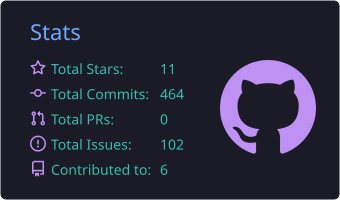
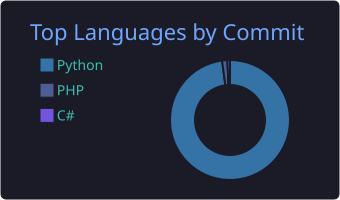

# 👋 Hi, I'm Amirhosein

**🧑‍💻 Programmer | 💻 Computer Enthusiast | 🌍 Language Learner | ⚽ Football | ♟️ Chess | 🎮 Gamer**

---

## ✨ About Me

- 🔹 Passionate about learning and exploring new technologies
- 🔹 Interested in **programming**, **computers**, **foreign languages** (English & French), **football**, **chess**, and **video games**
- 🔹 Currently improving my **English** (Upper-Intermediate level)

---

## 🤹 Skills

- 🐍 **Python**
- 🐘 **PHP**
- ⚡ **JavaScript (basic knowledge)**
- 🖥️ **C# (low level)**
- 🔗 **API Development** with **Django REST Framework**
- 🇺🇸 **English (Upper-Intermediate)**

---

## 🛠️ Technologies & Tools

  

---

## 📊 GitHub Stats

  
  

---

## 🌐 Let's Connect

---

✨ Always learning, always growing ✨
